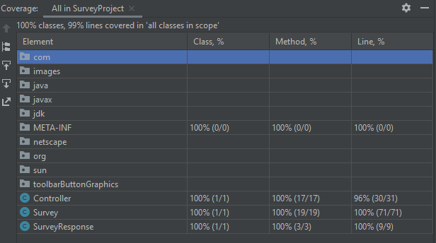
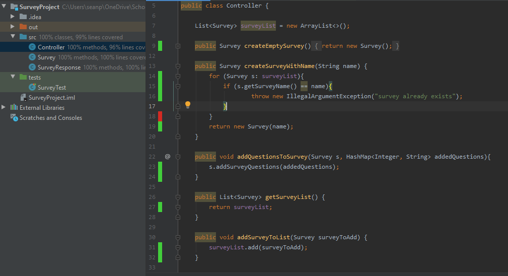

# Code Coverage

Code coverage or test coverage is a way of quantifying the amount of your source code that is being tested.

- Measurement of how many lines of code are executed while automated tests are running.

- It is used as an exit criteria for each milestone. E.g. Sprint

- In our example the specific code coverage metric will be 'coverage from unit tests'.

- Typically a good code coverage percentage is **85% - 90%**. - i.e. This is the percentage of your code that is covered by testing.

- The higher the percentage of code coverage, the less likelihood that bugs and defects will be an issue.

- A high coverage percentage does not mean your code is well tested. The quality of your unit tests will determine that.

- A popular tool used for Code Coverage is SonarQube.

  - Provides Macro metrics like Complexity.
  - Can see trends of code coverage. e.g. Is are coverage getting better or worse?

- Many IDE's have in built code coverage. Since I'm using IntelliJ, I will us the inbuilt code coverage tool provided by intelliJ.

---

## Total Code Coverage

From the image below you can see my code coverage is **99%** overall.

---

---

---

## Specific class Coverage

The areas highlighted green show code that is well covered.

The areas highlighted red show code that isn't well covered.

---

---

---

## Full Code Coverage report

[Full Code Coverage report](codeCoverageReport/index.html)

---

---

## Quick Links

- [Readme](../README.md)
- [UML Modelling](UMLModelling.md)
- [Sprint Backlog And Task Estimation](SprintBacklogAndTaskEstimation.md)
- [Unit Testing And Test Driven Development](UnitTestingAndTestDrivenDevelopment.md)
- [Team Version Control](TeamVersionControl.md)
- [Code Review Checklist](CodeReviewChecklist.md)
