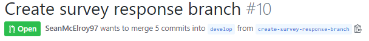
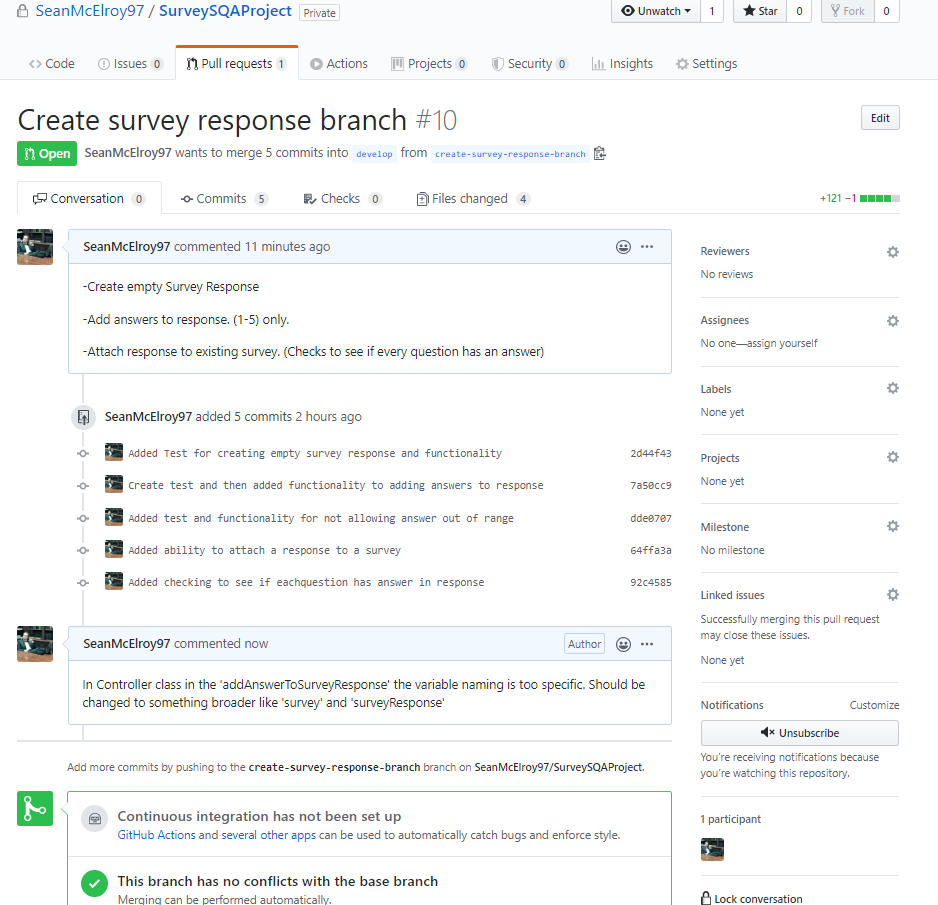
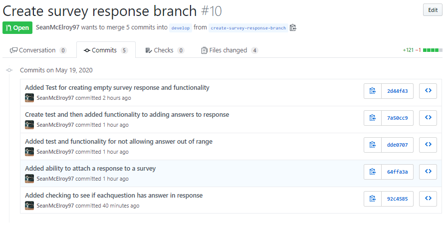
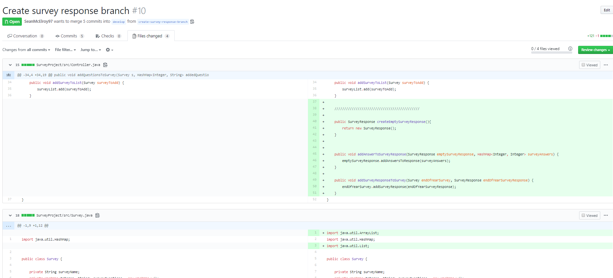

# Code Review Checklist

### Code Review

Mentioned briefly in the last section on Team Version Control.

Code reviews are neccessary to maintain consistency and minimize defects.
Its achieved by ideally, having as many team members as possible checking a software program, mainly by viewing/reading parts of the source code.
Code Reviews have been proven to accelerate the software development process.

In order to perform successful Code Reviews, a standard process for Code Reviews should be created and followed so the same standard of review is maintained for each PR(Pull Request).
Thats why a set of standard checks, known as your **'Code Review Checklist'** should be created.
Every team should configure their own checklist. This will lead to a common understanding and agreement for each step.

---

### Code Review Checklist

For our checklist we should follow these steps

1. Ensure Correct branch

   - The merge should be into the correct branch
   - feature branch should be merged with develop branch, not master branch

2. Check Conversation tab

   - There may be important information in the conversation tab.
   - Something the author wrote.
   - A comment that a fellow reviewer wrote.

3. Check commits tab

   - Shows high level view of commits
   - Should be able to decipher what each commit pertains to.

4. Verify changes

   - Involves checking the files tab.
   - Ensure code in files has good
     - Design. (Appropriate for system and format/style)
     - Functionality
     - Refactoring (i.e. easy to follow logic, not overly complex)
     - Testing
     - Naming convention

5. Commit Message accuracy
   - Ensure the commit messages describe what was committed

---

#### Remember

- The Reviewer should give honest feedback with the correct tone. The feedback should only concern the code, not the coder.

- The Author should try to make it as easy as possible for the reviewer to review. Follow the Git flow steps, explain your rationale, reply to questions.

---

### Code Review Example

[Pull Request](https://github.com/SeanMcElroy97/SurveySQAProject/pull/10)

---

### Step 1. Ensure Correct Branch

---

---

### Step 2. Check Conversation Tab.

---

---

### Step 3. Check Commits Tab.

---

---

### Step 4. Verify changes in files.

---

---

## Quick Links

- [Readme](../README.md)
- [UML Modelling](UMLModelling.md)
- [Sprint Backlog And Task Estimation](SprintBacklogAndTaskEstimation.md)
- [Unit Testing And Test Driven Development](UnitTestingAndTestDrivenDevelopment.md)
- [Team Version Control](TeamVersionControl.md)
