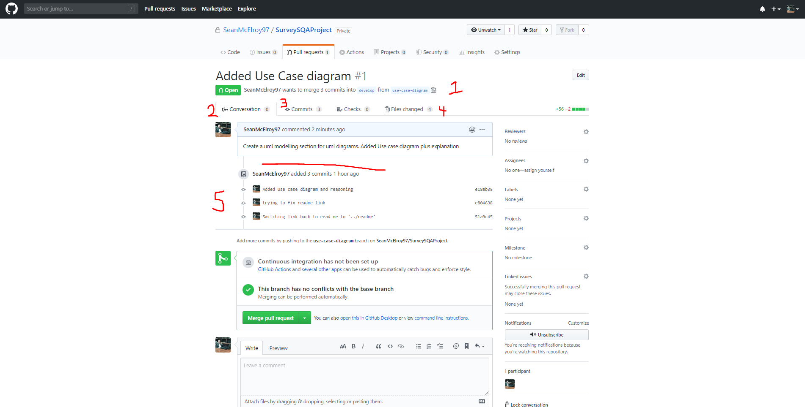

# Code Review Checklist

### Code Review

Mentioned briefly in the last section on Team Version Control.

Code reviews are neccessary to maintain consistency and minimize defects.
Its achieved by ideally, having as many team members as possible checking a software program, mainly by viewing/reading parts of the source code.
Code Reviews have been proven to accelerate the software development process.

In order to perform successful Code Reviews, a standard process for Code Reviews should be created and followed so the same standard of review is maintained for each PR(Pull Request).
Thats why a set of standard checks, known as your **'Code Review Checklist'** should be created.
Every team should configure their own checklist. This will lead to a common understanding and agreement for each step.

---

### Code Review Checklists

For our checklists we should follow these steps

1. Ensure Correct branch

   - feature branch should be merged with develop not master

2. Check Conversation tab

   - There may be important information in the conversation tab.
   - something the author wrote
   - or a comment that a fellow reviwer wrote.

3. Check commits tab

   - Shows high level view of commits
   - Should be able to decipher what each commit pertains to.

4. Verify changes

   - Involves checking the files tab.
   - Ensure code in files has good
     - Design. (Appropriate for system and format/style)
     - Functionality
     - Refactoring (i.e. not too complex to follow)
     - Testing
     - Naming convention

5. Commit Message accuracy
   - Ensure the commit messages describe what was committed

---

### Code Review Example

---

---

---
