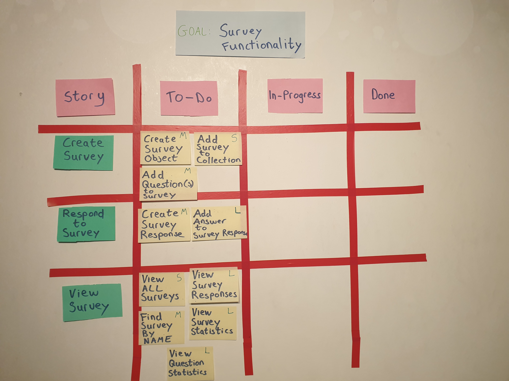
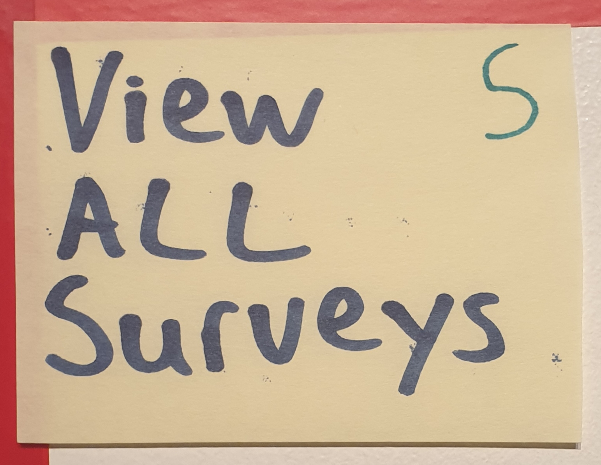
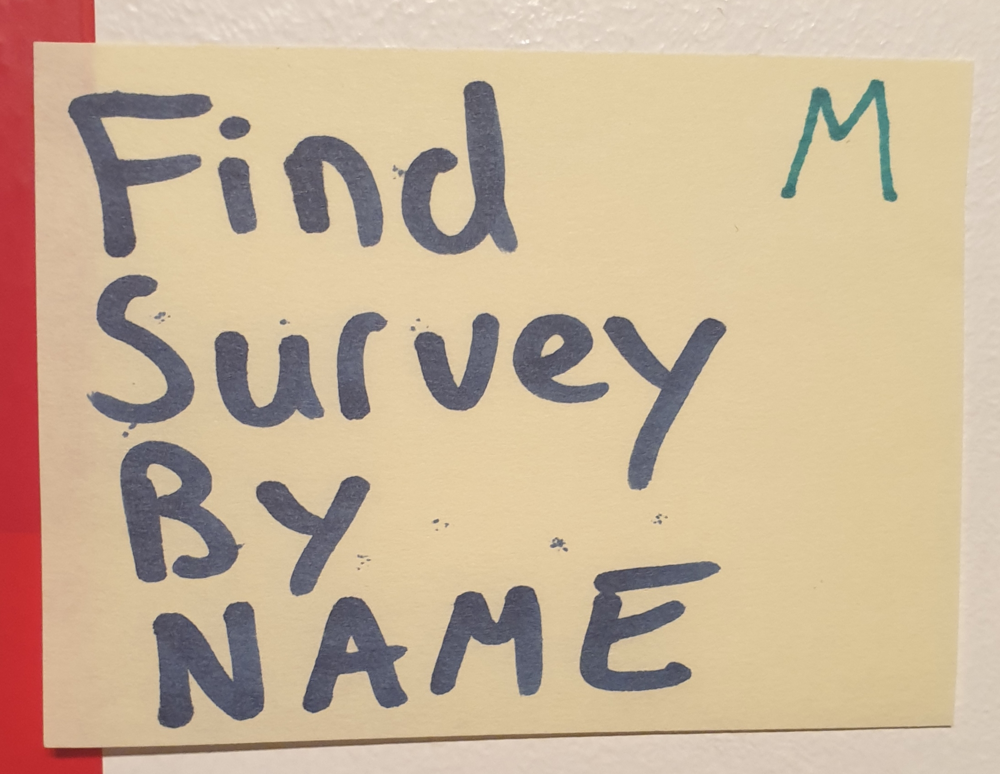
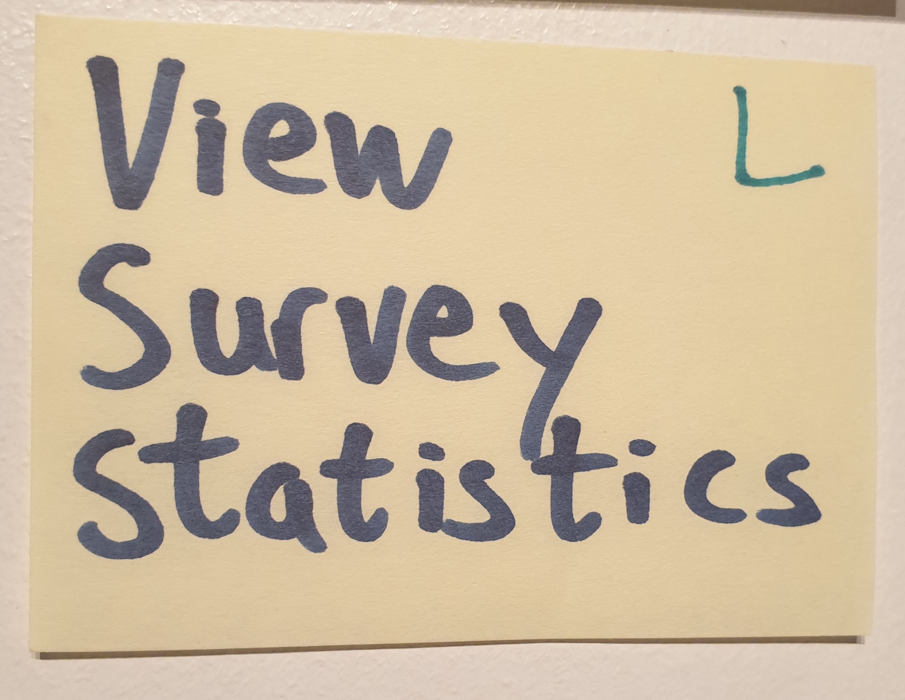

# Sprint Backlog + Task Estimation

Having already created a use case diagram and class diagram, we are ready to move onto the sprint backlog.

Sprint Backlog is a Scrum Artifact

### Background on Scrum

Scrum is an agile framework used for developing and delivering software in short periods of time.
These short periods of time are called sprints, generally a 2 week period that starts with a **Sprint plan** and ends with shippable code.

### Sprint Backlog

A **Sprint Backlog** is a Scrum artifact.
It contains

- User Stories (informal description of a feature to be available)
- Tasks. Within the user stories we have tasks that need be **done** to complete user story
  - These Tasks are a subset of product backlog(list of all tasks) to be completed within a given sprint.

The Sprint backlog is designed to be mutable so tasks can be added or updated if need be.
This is another way that scrum supports agile development.

---

### Sprint Backlog Categories

The Sprint Backlog/Sprint board can be broken down into 3 categories

1. To-Do
   - Tasks that have to be started
2. In-Progress
   - Tasks that a developer has begun working on but are not complete
3. Done
   - This can be misconstrued. It means the task has been tested and passed and is completely ready for merging into release branch.

The way i have decided to track development progress is known as the white board method.

Where the user stories and tasks are put on white board in the different sections. (Bedroom wall in my case)

Other options include project management tools like Jira and Github Project Management that are web based tools.

The whiteboard method provides clarity and tangibility, as well as a reminder of the overall goal.

---

---

---

### Prioritization

Prioritization is the process of ensuring the most essential functionality gets done first. The process becomes more difficult the larger the list of tasks becomes.
A methodoly i decided to use when prioritizing the functionality a.k.a my user stories was the **"MoSCoW Rules"**

### MoSCoW Rules

- Must Have.

  - User stories that are part of core functionality. Essential.
  - (**Create Survey**, **Respond to Survey**).

- Should Have

  - These feauture are not part of core functionality but equally important.
  - (**View Survey**).

- Could Have

  - Not core or necessary but would benefit the feature.
    - (A not so important part of View Survey story is **"survey statistics"**).

- Won't Have
  - Most likely will not have time to implement, but potentially in a later sprint.
  - (E.g A user interface feature for survey project).

From the board my prioritization works from top to bottom. Highest physically on board is highest priority

---

### Task Estimation/Sizing

### T-shirt Sizing

I'm using T-shirt size method. I believe this is the most straight - forward method of task estimation for new developers and also understandable by people on the business side.

It's based on sizes of t-shirts (surprisingly).

Generally T-shirts come in small, medium, large and extra large.

Making estimates allows the process to go much quicker than traditional **Fibonacci sequence** estimation.
The Fibonacci sequence. Each number is a sum of the two preceding numbers in the sequence. 1,2,3,5,8.

The sizing in terms of time/hours depends on the project scope (size of project).

In our small survey project.
My sizing translates to.

- S - predicting < 1
- M - predicting between 1 & 3 hours
- L - Anything predicted to take more than 3 hours

---

&nbsp;&nbsp;&nbsp;&nbsp;&nbsp;&nbsp;

&nbsp;&nbsp;&nbsp;&nbsp;&nbsp;&nbsp;

---

---

### My Sizing

Here are examples of some of my task estimations, far left I have a task marked 'S' = small. middle I have task marked 'M'= medium. and to the right I have a task marked 'L' = large.

- Small

  - (View All Surveys) I believe this task is relatively straightforward as have a lot of experience iterating through collections and some collections have a retrieve all function built in. Small amount of time needed.

- Medium

  - (Find Survey By Name) This task is similar to first as it involves going through a list but must find and retrieve particular Survey. Should be manageable and completed within a few hours. Thus i marked this task as Medium.

- Large

  - (View Survey Statistics) Statistical calculations is something i have little experience so the doubt factor increases the time i believe this will take. I believe this is one of the trickier tasks of the project thus making it an estimation of Large.

---

### Velocity Metric

maybe image of a velocity metric

---

---

## Quick Links

- [Readme](../README.md)
- [UML Modelling](UMLModelling.md)
