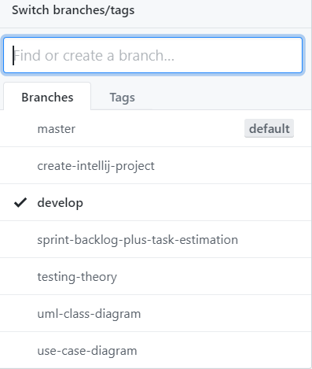

# Team Version Control

### Version Control

- Version control is a system that tracks/records changes to a file or set of files over time.
- Allows you to recall specific version later.
- Facilitated by **Version Control System**.
  - popular ones include 'AWS Code Commit' and **'Git'**.

---

### Team Version Control

- This is version control but with many people involved with the same file or set of files.
- This is a standard process in a software development team.
- This adds to risk of complications.
- complications like conflicts due to same file being changed by 2 developers.
- Another complication could be conflict of edits being made to different versions of files.

To help minimize the potential pitfalls of team version control.

Every developer on team must agree on a standard process of making changes within projects.

A good process to follow for Team version control is the **git flow process**

---

## Git flow process

It defines a strict branching model design.
Each branch has specific role.

From the image below, if my branching naming is correct you should be able to determine what functionality is in what branch

- 'sprint-backlog-plus-task-estimation'

  - this branch is where i included my sprint backlog and my task estimates.

- 'testing-theory'
  - this branch explains the theory by test driven development and my process for unit testing.

---

## Some of the branches, most created off of 'develop' branch.

---

---

## Git flow Steps

The workflow steps we should follow during development are

1. Create the project

   - locally or directly on DVCS like Github
   - DVCS = Distributed Version control system

2. Create 'develop' branch off of 'master'

   - 'master' branch can be seen as the production code.
   - only make release changes to the master branch
   - instead make a develop branch.
   - all further features will be branched off 'develop'.

3. Clone this repository on your local machines

   - Each developer working on this project should clone the repository.
   - When making individual changes create a copy on your local machine.

4. Create feature branch.

   - Before making changes you should create a branch off develop
   - This branch should contain changes for one feature.
   - Adequately named branches should be able to convey what functionality is inside.

5. Make Regular commits

   - Commit early and often when adding specific aspects of the feature.
   - This helps not only as a backup if something goes wrong during development.
   - But also helps other developers, who are reading/reviewing it, to see what changes were made and when.

6. Make a Pull Request

   - A pull request is an attempt to merge changes you've made into another branch.
   - It involves the code in one branch joining another.
   - In my case the code from feature branches to the develop branch.
     - The code in my feature branch is now being added to develop.

7. Code Review

   - Before code is merged into a higher branch, it's important for other developers to check/review this.
   - This will hopefully allow any potential issues to be spotted.
   - Developers should follow a check list when reviewing a pull request. (Checklist covered in next section)
   - If any issues are spotted, the reviewer can comment, notifying the author who should fix the issues.

8. Accept/Merge Pull request

   - After the code looks ok to be merged. (Reviewers are happy for this to be merged)
   - The author should merge code into the upper branch e.g. 'develop'

9. Pull latest

   - This step is important to avoid potential conflicts.
   - Each developer should pull the latest versions of the project, before making further changes.
   - Can pull latest changes with a command like 'git pull (desired branch name)'

10. Create Release Branch and Merge with master

- Before merging your code into production you should create a release branch.
- Create a release branch off of develop.
- E.g. 'release-1.1.0'.
- Once you are happy you can merge this with master and develop.

---

---

## Quick Links

- [Readme](../README.md)
- [UML Modelling](UMLModelling.md)
- [Sprint Backlog And Task Estimation](SprintBacklogAndTaskEstimation.md)
- [Unit Testing And Test Driven Development](UnitTestingAndTestDrivenDevelopment.md)
- [Code coverage](CodeCoverage.md)
- [Code Review Checklist](CodeReviewChecklist.md)
