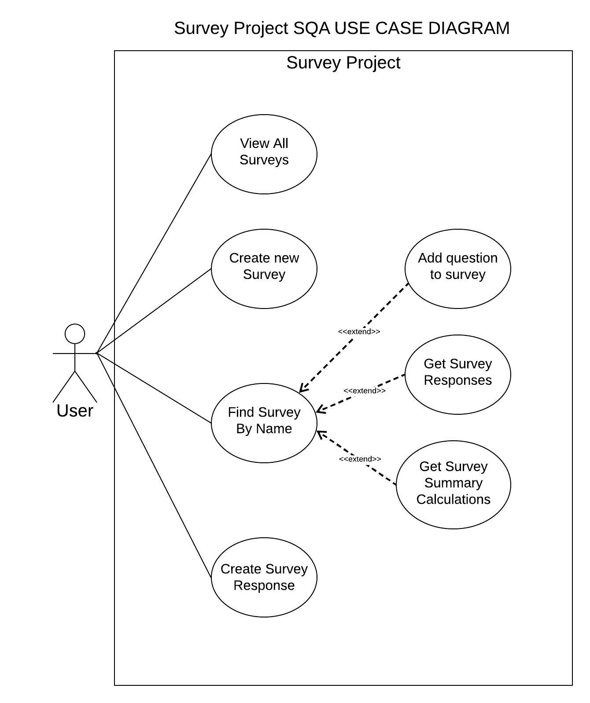
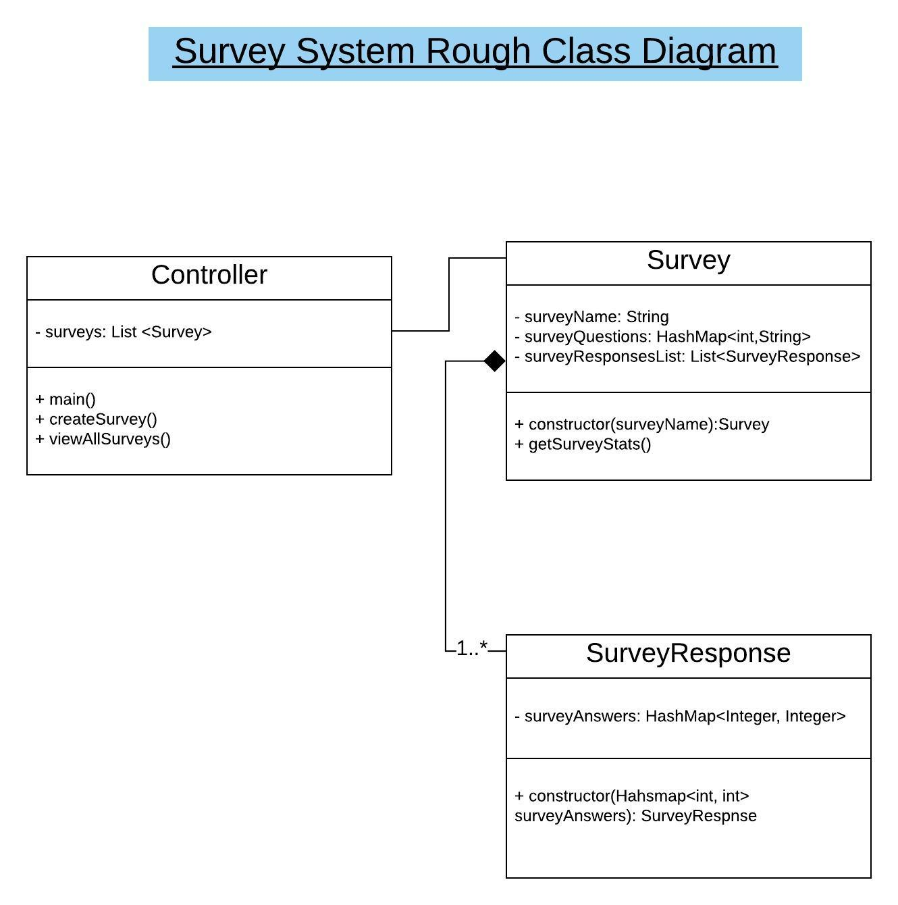

# Diagraming Tool

I used **lucidChart** for my diagrams. Lucid chart is a web-based app that enables visual communication of complex systems.
Supports flowcharts, process maps, **UML models** and organizational charts.
It also supports collaboration for teams to utilize for better data visualization.

### UML Use Case Diagram

A use case diagram is a simple representation of a user(s) interaction with a system/feature/app.
It's a high-level view that helps highlight

- Users involved
- Possible use cases
- Relationships the user(s) have with the different use cases

Use case diagrams are great way to convey an idea. It allows your team members to see exactly how the user will interact with app.
They are a great starting point for development.
Non-technical people can view the use case diagram and get a general undertsanding of the application

For our survey project, the use case diagram looks like this...

---

---

---

### UML Class Diagram

A class diagram is another visualization tool. It describes the structure of a system by showing the system's classes.
Reasons for building these are

- It identifies the classes attributes (properties of the class) and methods(behaviours of the class).
- More detailed look for developers to understand how the system works
- Identifys the relationships within the strcuture between the classes

Some key relationships

- black diamond refers to composition where one class cannot exist without the other. (SurveyResponse needs a Survey)
- straight line refers to simple relationship. Association between two. (Controller relationship with Survey)

The reason It's a good practice to make a class diagram is so you do not blindly begin task creation or estimation without seeing a bigger picture of the system and its interactions.

Below you can see a rough uml class diagram for our Survey project. Some attributes and methods left out for brevity and may decide to make some small add-ons, but it shows how the system will work.

---

---

---

## Quick Links

- [Readme](../README.md)
- [Sprint Backlog And Task Estimation](SprintBacklogAndTaskEstimation.md)
