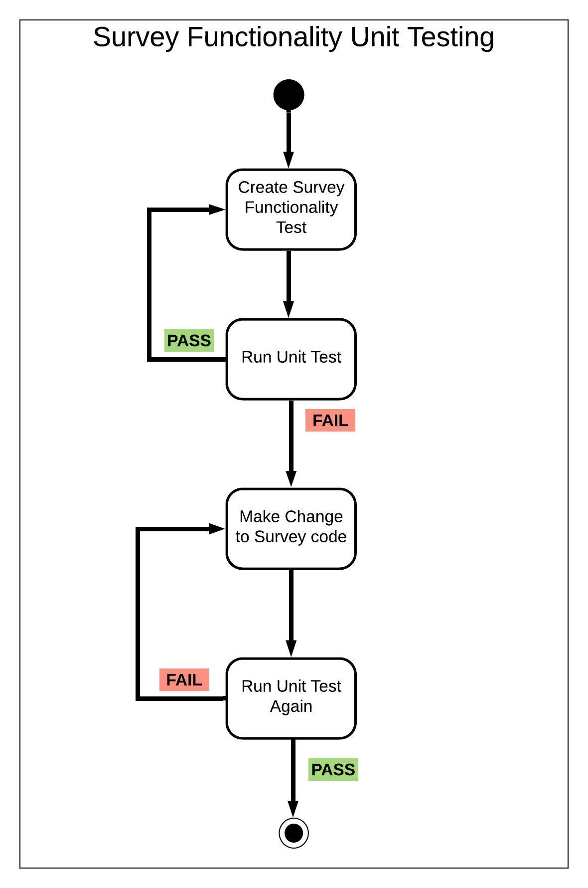
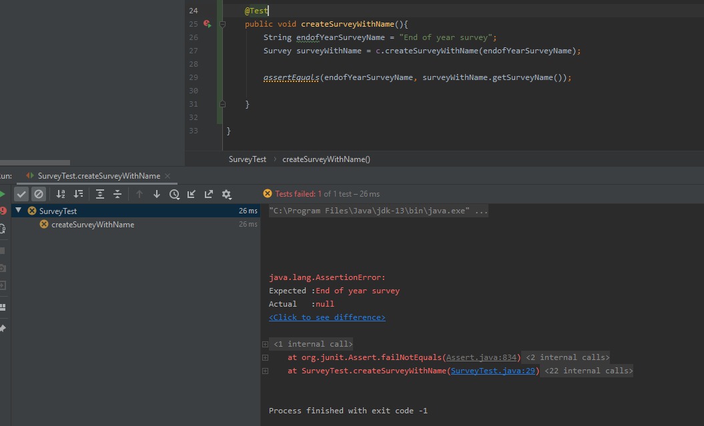
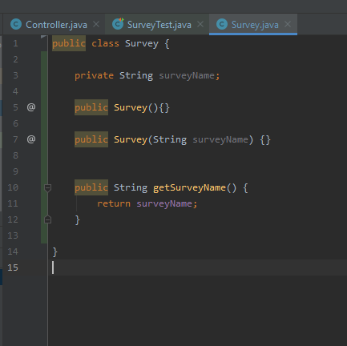
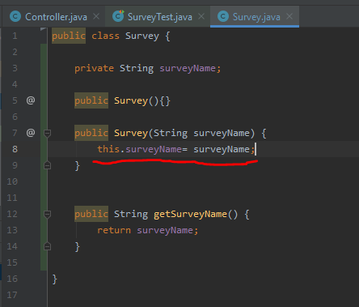
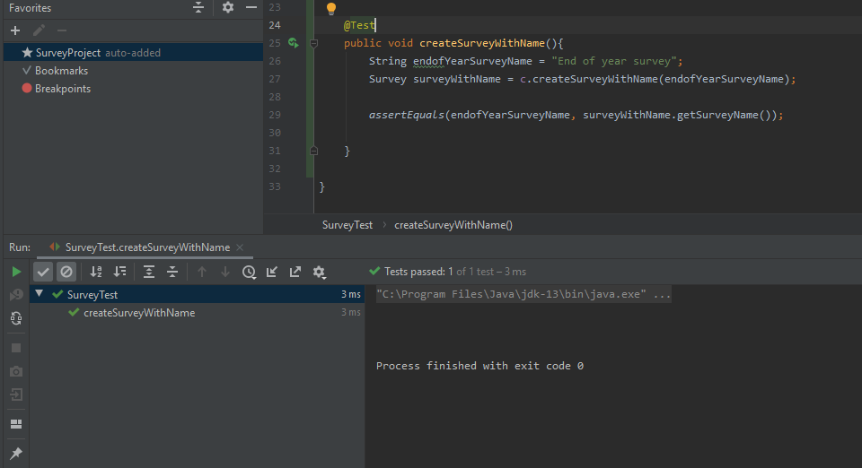

# Unit Testing And Test Driven Development

<ins>_Testing is a requirement to ensure quality and minimize defects_</ins>

Test Driven Development is a software development process/methodology.

It relies on the repetition of very short development cycles.
Unit Tests are used to drive the development of the application.

The key is **writing tests before writing code**.

This lets a developer keep focus on what the component is supposed to do. Avoid Over engineering problems

---

## Unit Testing

Unit testing is the process of inoking a unit of work in the system and checks a single assumption.

Testing the smallest unit of software design. One unit test is a test case.

The test case is given

- set of inputs
- expected output

It checks a piece of source code to see if the output is what you are expecting.

Test cases should cover

- independent paths
  - All paths should be covered e.g if else = 2 paths
- Error-handling paths
  - Anticipate some error conditions, throw correct exception which should be descriptive + return accurate error message.
- Boundary cases
  - Very important. Test some cases right between paths. test max Value && test min Value.
- Interface
  - Does information flow corectly in and out of the component.
- Local data structures
  - Does data structure maintain data reliably throughout use of component

Unit tests are written with the help of a **unit test framework**.
In Java some examples of test frameworks are TestNG and **JUnit**.

In my case I will use the **JUnit** framework as i have some experience with this.
It uses annotations to identify test methods.
The most current version is JUnit 5 but i will probably use JUnit 4 as it contains some potential annotations that may be useful for me.

- '@Test (expected = Exception.class)'

---

### Red-green-refactor cycle

This is the process of

1. Create test for functionality
2. Run it to ensure it fails (Red)
3. Make adjustments to code. (Refactoring)
4. Run test again.
5. Repeat 3 & 4 until tests pass
6. May Refactor code without changing behaviour

The reason you want to make test fail first is to ensure your change of code is making the test pass.

Red-green-refactor cycler helps achieve a simpler design solution with reduced coupling.

The process I will follow for unit testing.

---

---

---

## Specific example

- [link to commit](https://github.com/SeanMcElroy97/SurveySQAProject/pull/8/commits/e3c43212f812e8257b25f698d25eb22e09fc9f21)

## Create Test for functionality + Run it to ensure it fails

- Red

---

---

---

---

## Make adjustments to code + Run test again. Repeat unti test pass

- Green

---

---

---

---

## Quick Links

- [Readme](../README.md)
- [UML Modelling](UMLModelling.md)
- [Sprint Backlog And Task Estimation](SprintBacklogAndTaskEstimation.md)
- [Team Version Control](TeamVersionControl.md)
- [Code Review Checklist](CodeReviewChecklist.md)
